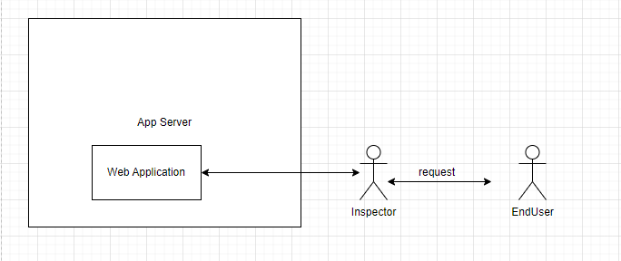
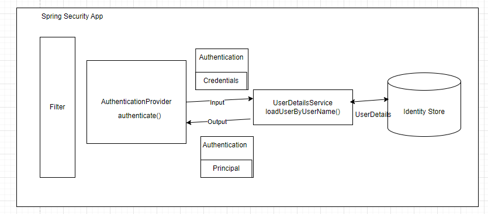

When you add the Spring security dependencies, springboot framework starts intercepting the requests right out of gate:

how is it able to do that even ??

SpringBoot uses something called `Filters` which lets us intercept request as if requests goes through each of the filters
and we can basically intercept each requests and will allow based on the set configurations

These filters can be applied to a wide range of URL's - something like `/admin/*` - do checks the on any url admin
What filters do -> it takes the request and tries to map it to spring boot security own filter called `DeligatingFilterProxy`

springSecurityFilterChain - filterName
/admin/* - urlPattern

So, just in case if you want to secure only one part of application then it kind of makes the whole app vulnerable then the entire application is not secure

So in terms of a Spring boot scenario, we kind of tell Spring security that our **requirement of authentication and authorization as per url's** in that way 
we can filter requests based on roles
We can decide on what to do with authentication and authorization

 - In spring boot world it creates the output for an authentication as Principle 
and actually these requests are sent `AuthenticationProvider` interface and we need to add implementation of these interfaces 
and basically implement the `authenticate` method in our app and tell Spring security about it

How Springboot sees Authentication?

The AuthenticationProvider takes credentials as input in Authentication instance and gives output as principle in Authentication instance

A single app can have multiple authentication mechanism eg : SSO authentication, LDAP, Multi-factor, Oauth, username-password \

Authentication Managers tries to delegate the kind of AuthenticationRequest to specific provider

Think about `AuthenticationProvider` - if its a LDAP or username password then it would fetch from Db(Identity Store)
and will verify with the credentials (pretty much same as how we fetch the username and password).

Spring Security has extracted the part where we retrieve data from Identity Store into _UserDetailsService_ interface

UserDetails Interface:
1. getAuthorities() - returns authorities granted to user - Collection<? extends GrantedAuthority>
2. getPassword() - return password related to authenticated user - String
3. getUserName() - return userName related to authenticated user - String
4. isAccountExpired() - returns if account expired - boolean
5. isAccountNotLocked() - return is account locked or not - boolean
6. isCredentialsExpired() - user credentials has expired or not - boolean
7. isEnabled - user is enabled or disabled - boolean

This is what AuthenticationProvider gets and it verifies and sends Authentication instance of Principle as output

Overall : 

It takes the Authentication in a thread and saves it - 

It takes the result of Authentication put in security context - used for further use like authorization, for use in identifying current Principle
Spring boot has mechanism to store this in Session for the duration of that session for 
There is one filter which manages the User session.

